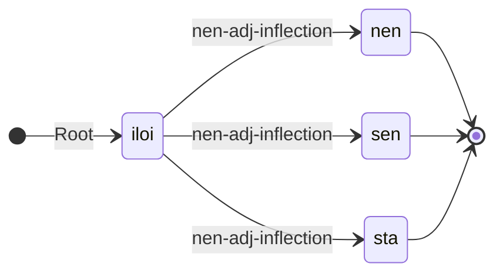

---
# try also 'default' to start simple
theme: seriph
# random image from a curated Unsplash collection by Anthony
# like them? see <https://unsplash.com/collections/94734566/slidev>
background: uit_bakgrunn.png
# apply any windi css classes to the current slide
class: 'text-center'
# https://sli.dev/custom/highlighters.html
highlighter: shiki
# show line numbers in code blocks
lineNumbers: false
# some information about the slides, markdown enabled
info: |
  ## Slidev Starter Template
  Presentation slides for developers.

  Learn more at [Sli.dev](https://sli.dev)
# persist drawings in exports and build
drawings:
  persist: false
title: "The GiellaLT infrastructure & LT for minority languages"
---

# The GiellaLT infrastructure & <br/> LT for minority languages

Sjur Nørstebø Moshagen <br/>
The Divvun Group, UiT

---

Presentation plan:

<br/>
<br/>

<Toc columns="2" maxDepth="1"/>

<!--

# Main sections

<v-clicks>

- Introduction
- Minority languages and requirements for LT development
- GiellaLT infra
- lexc & twolc as linguistic programming languages
- development
- tools
- demo
- summary
- links

</v-clicks>

-->

---
layout: section
---

# Introduction

---

## About me

<br/>
<br/>

<v-clicks>

* Sjur Nørstebø Moshagen
* Linguistics, nordic languages & computer science
* Lingsoft
* Sámi Parliament
* UiT the Arctic University of Norway
* heading the Divvun group at UiT
* 30 years experience with language technology

</v-clicks>

---

## What is language technology

<br/>
<br/>

A very brief history — from cuneiform to speech recognition

---
layout: two-cols
---

### The first language technology

<br/>


::right::

<br/>
<br/>

By unknown artist - <a href="//commons.wikimedia.org/wiki/User:Jastrow" title="User:Jastrow">Marie-Lan Nguyen</a> (2005), Public Domain, <a href="https://commons.wikimedia.org/w/index.php?curid=407203">link to original</a>

> Contract for the sale of a field and a house in the wedge-shaped cuneiform adapted for clay tablets, Shuruppak, circa 2600 BC.


---
layout: two-cols
---

### Another instance of long-lasting language technology

<br/>


::right::

<br/>
<br/>
<br/>

Av <a href="//commons.wikimedia.org/wiki/User:Berig" title="User:Berig">Berig</a>, <a href="https://creativecommons.org/licenses/by/2.5" title="Creative Commons Attribution 2.5">CC BY 2.5</a>, <a href="https://commons.wikimedia.org/w/index.php?curid=2287417">lenke til original</a>

> Lingsbergsteinen i Sverige, katalogisert som «U 240», ca 1040
>
> <br/>
>
> ᛏᛆᚿ ᛆᚢᚴ ᚼᚢᛌᚴᛆᚱᛚ ᛭ ᛆᚢᚴ ᛌᚢᛆᚿ ᛭ ᛆᚢᚴ ᚼᚢᛚᛘᚠᚱᛁᚦᚱ ᛭ ᚦᛆᚢᚿ (ᛘᛁᚦ)ᚴᛁᚿ ᛚᚴᛏᚢ ᚱᛁᛏᛆ ᛋᛏᛁᚿ ᚦᛁᚿᚮ ᛭ ᛆᚠᛏᛁᚱ ᚼᛆᛚᚠᛏᛆᚿ ᛭ ᚠᛆ(ᚦ)ᚢᚱ ᚦᛆᛁᚱᛆ ᛏᛆᚿᛋ ' ᛆᚢᚴ ᚼᚢᛘ(ᚠ)ᚱᛁᚦᚱ ᛆᛏ ᛒᚢᛆᚿᛏᛆ ᛋᛁᚿ
>
> <br/>
>
> tan auk hus(k)arl + auk suain + auk hulmfriþr × þaun (m)(i)(þ)kin litu rita stin þino × aftiʀ halftan + fa(þ)ur þaiʀa tans ' auk hum(f)riþr at buanta sin
>
> <br/>
>
> Dan ok Huskarl ok Svæinn ok Holmfriðr, þaun møðgin letu retta stæin þenna æftiʀ Halfdan, faður þæiʀa Dans, ok Holmfriðr at boanda sinn.
>
> <br/>
>
> «Dan och Húskarl och Sveinn och Holmfríð, modern och (hennes) söner, uppförde denna sten till minne av Halfdan, fadern till Dan och hans bröder; och Holmfríð till minne av sin man»

---
layout: two-cols
---

### A third instance of long-lasting language technology

<br/>


::right::

<br/>
<br/>
<br/>
<br/>

By <a href="https://en.wikipedia.org/wiki/en:Daniel_Chodowiecki" class="extiw" title="w:en:Daniel Chodowiecki"><span title="German painter and printmaker">Daniel Nikolaus Chodowiecki</span></a> - DANIEL CHODOWIECKI 62 bisher unveröffentlichte Handzeichnungen zu dem Elementarwerk von Johann Bernhard Basedow. Mit einem Vorworte von Max von Boehn. Voigtländer-Tetzner, Frankfurt am Main 1922. (self scanned from book), Public Domain, <a href="https://commons.wikimedia.org/w/index.php?curid=17927966">Link</a>

---
layout: two-cols
---

### Today — information technology

<br/>


::right::

<br/>
<br/>

[Source, public domain](https://gv.m.wikipedia.org/wiki/Coadan:Applications-internet.svg)

<br/>
<br/>

Does only last as long as the storage (or much shorter), in contrast with older technologies.

---
layout: two-cols
---

### Language technology proper

The term language technology is restricted to actual processing of language
data — be it speech or text or video (as when processing signed languages).

The ultimate dream of language technology was from early on speech-to-speech machine translation of unrestricted language:

<a href="https://poetsandquants.com/2014/07/02/when-translators-make-sense-for-applicants/">

<br/>
Image source
</a>

::right::

<br/>
<br/>

— Or a talking and swearing bot?

<a href="https://www.springboard.com/blog/news/chatgpt-revolution/">

<br/>
Image source
</a>

We are here now!


---

## Language technology is transformative

In all cases language (and information) technology has been pretty transformative.

<v-click>

### … and divisive

Another typical characteristic of language technology is that it is divisive:

* those with access
* those without

<br/>


</v-click>

---

## LT divide

Empowering those with access, leaving those without behind. As such it can easily
be a driver in language extinction — to take part in the society at large, you can't
use your own language because the society expects use of certain technologies:

<v-clicks>

* a certain alphabet or writing system — ie literacy
* access to a printing press
* access to computers
* access to your letters on that computer

</v-clicks>

<v-clicks>

For speakers of most of the languages of the world (there are about 7000) one or several of the points above are **not true**, and will only add to all the other factors driving language death.

One of the main objectives of the **GiellaLT** infrastructure is to help counter this, by developing language technology for such languages, to make them easy to use on digital devices.

Our starting point and main focus is the Sámi languages, but everything that we make is language independent (except for the linguistic data, obviously), and we actively cooperate with other groups to extend the reach of our technology.

</v-clicks>

---
layout: section
---

# Minority languages and requirements for LT development

<!-- 2022 marks the start of the UN [International Decade for Indigenous languages](https://en.unesco.org/idil2022-2032). Our work directly supports the goals of IDIL 2022-32. -->

---

## Characteristics of minority language technology development

Typically, minority languages share a number of characteristics:

<v-clicks>

* few or non-existing digital resources
* restricted availability of dictionaries and grammars, or none at all
* often complex morphology or morphophonology or both
    * compare with ML technology needs

</v-clicks>

<v-clicks>

That is, the dominating language technology paradigm — machine learning & neural nets (ML) — has very little to offer.

Especially since normativity and language care and support is typically much more central to minorities.

```sh
Note that things are developing very fast, we have not seen the end of ML progress.
Still, the note about normativity is a real concern.
```

But more on that later, and on what it can offer.

</v-clicks>


---

## Reuse, multi-use and normativity

Because of the costs of language technology projects, it is important to build your infra and resources with reuse in mind, and also plan them so that everything is prepared for multiple usage scenarios.

E.g. in the GiellaLT infrastructure, we have standardised conventions that makes it easy to build both **normative** and **descriptive** tools from the same codebase.

<v-clicks>

* **normative:** tools that adhere strictly to an agreed-upon norm for writing, and try to correct text so that deviations are brought in line with the norm: spelling checkers and grammar checkers.<br/>*The language as it should be.*
* **descriptive:** tools that try to process all texts in a language, including erroneous and non-standard texts<br/>*The language as it really is.*

</v-clicks>

---

## GiellaLT: Mainly rule-based

Language technology comes in several flavours:

<v-clicks>

* explicit knowledge:
    * rule-based
* implicit knowledge — machine learning:
    * statistical
    * stochastic
    * neural nets

</v-clicks>

<v-clicks>

Typical for all but the rule-based one is that they require large amounts of raw data to be trained on.

Rule based technologies on the other hand, in principle only requires a mother
tongue speaker and a linguist (which in the best of cases is one and the same person).

</v-clicks>

---

## Basic working of rule-based technologies


---

## Main sources for building the grammars and language resources

<br/>
<br/>

<v-clicks>

* digital dictionaries
* grammars
* corpus
* native speakers

</v-clicks>

---
layout: section
---

# The GiellaLT infrastructure

---

## Main features of the GiellaLT infrastructure

<br/>
<br/>

<v-clicks>

* language independent infrastructure
* scalability in two dimensions: languages x tools/products
* standardised dir & file structure
* encourages and facilitates international cooperation
* ~160 languages in our infra (at various stages), 30+ in active development
    * almost all of them minority languages
    * majority language grammars and LT resources mainly to support the minority languages
      (but we do not exclude anyone)

</v-clicks>


---

## Scalability

<v-clicks>

* for languages:
    * template for all resources needed to start a new language grammar
* for tools:
    * add support for a new tool to the template, and propagate it to all existing languages
* core design principle:
    * separate language independent processing from language-specific processing

</v-clicks>

<v-clicks>

The templating system and the split between language independent and specific code ensures that we can add as many languages as we want, and easily add support for new tools and technologies.

</v-clicks>

---

## Standardised dir structure

```
.
├── devtools
├── docs
├── src
│   ├── cg3
│   └── fst
│       ├── filters
│       ├── morphology
│       ├── orthography
│       ├── phonetics
│       ├── syllabification
│       ├── tagsets
│       └── transcriptions
└── tools
    ├── analysers
    ├── grammarcheckers
    ├── hyphenators
    ├── mt
    ├── shellscripts
    ├── spellcheckers
    ├── tokenisers
    └── tts
```


---

## International cooperation

<br/>


---

## Some language repositories

With maturity and license, bug and build status ([giellalt.github.io/LanguageModels.html](https://giellalt.github.io/LanguageModels.html)).


---
layout: section
---

# Linguistic programming

---

## Formalisms / technologies used

<br/>
<br/>

* **morphology / morphophonology:** Hfst / Foma / (Xerox)
    * lexc
    * twolc
    * xfst rewrite rules
    * Xerox-style pmatch scripts
* **syntax:** Constraint grammar (in the form of *VISLCG3* )

All of these are open source except for the Xerox tools (which are free, though). Foma does not support TwolC (see further down).

---
layout: two-cols
---
## LexC

<br/>
<br/>

<v-clicks>

* excellent for concatenative morphology
* specify stems and affixes in different lexicons
    * abstractions over stem classes and inflections
* a programming language for linguists
* ... where you spell out the morphology of a language such that a compiler can
  turn it into an executable program

</v-clicks>

<v-clicks>

```
LEXICON Root
  iloinen:iloi nen-adj-inflection ;

LEXICON nen-adj-inflection
  +A+Sg+Nom:nen # ;
  +A+Sg+Gen:sen # ;
  +A+Sg+Par:sta # ;
```

</v-clicks>

::right::

<br/>
<br/>
<br/>
<br/>
<br/>
<br/>
<br/>
<br/>
<br/>

<div v-after>

The same as a state diagram:



</div>


---

## TwolC

<br/>
<br/>

<v-clicks>

* Formalism developed by Dr Kimmo Koskenniemi in the early 80's to describe phonological processes
* resembles quite closely generative rewrite rules of the form:
   ```
   A -> B / C _ D
   ```
* rules are unordered and applied in parallel

</v-clicks>

---

## Xfst rewrite rules

<br/>
<br/>

<v-clicks>

* another formalism to describe phonology
* main difference to TwolC: rules are ordered and applied in sequence

</v-clicks>

<v-clicks>

Both TwolC and Xfst rewrite rules are supported by the GiellaLT infrastructure, compilation support is dependent on the compiler tool used:

`Foma` does not support Twolc, everything else is supported by all tools

</v-clicks>

---

## Xerox-style pmatch scripts

<v-clicks>

Hfst only, this formalism is an extension of the xfst rewrite rules, and are a reimplementation of work by Xerox around 12 years ago. It allows for more complex text processing, and with a few modifications we have turned the formalism into a tokeniser-and-morphological-analyser that will also output ambiguous tokens. Such ambiguity can then be resolved using Constraint Grammar (see next), followed by a simple reformatter that rewrites tokens that are split in two.

Using this setup it is possible to get the tokenisation almost perfect. In practice we still have some work to do, but we are already well above the alternative methods.

The pmatch scripts are key to a recent addition to our infrastructure: rule-based grammar checking. We are also developing text-to-speech systems using pmatch scripts + VISLCG3 processing to turn raw text into disambiguated text streams that can be fed to the synthesis engine.

> For speech synthesis this means that we use rule-based technologies for everything but the actual synthesis modelling, reducing the corpus need to less than 10 hours of studio recordings. That is within reach for most language communities.

</v-clicks>

---

## Constraint grammar


<br/>
<br/>

<v-clicks>

* formalism developed at Helsinki university by Fred Karlsson, later extended by Tapanainen (CG2), and further by the VISL project (CG3)
* main idea is to remove or select specific possible readings of ambiguous words given context constraints:
  > in the context of a subject personal pronoun, select a verb reading that agrees with the pronoun in person and number
  > <br/><br/>
  > Cf. German `haben`: can be both Infinitive, 1Pl and 3Pl.
  > <br/><br/>
  > But with a subject pronoun
  > `wir`, only 1Pl makes sense, so select it.
* used a lot in text parsers in combination with morphological analysers, giving very good results
* also used in language technology tools and products such as machine translation and grammar checking since the late 1990's

</v-clicks>

---

## Testing

Systematic testing is essential, and the infrastructure supports several types of tests:

* classes of words/inflections/alternations
* lemmas
* in-source test data

Example test data (South Sámi):

```
Tests:

  Verb - båetedh: # verb I, stem -ie, root vowel -åe-
    båetedh+V+IV+Inf: båetedh
    båetedh+V+IV+Ind+Prs+Sg1: båatam
    båetedh+V+IV+Ind+Prs+Sg2: båatah
    båetedh+V+IV+Ind+Prs+Sg3: båata
    båetedh+V+IV+Ind+Prs+Du1: båetien
    båetedh+V+IV+Ind+Prs+Du2: [båeteden, båetiejidien]
    båetedh+V+IV+Ind+Prs+Du3: båetiejægan
    båetedh+V+IV+Ind+Prs+Pl1: [båetebe, båetiejibie]
    båetedh+V+IV+Ind+Prs+Pl2: [båetede, båetiejidie]
    båetedh+V+IV+Ind+Prs+Pl3: båetieh
```

<!-- This can be used both as a development gold standard, and as regression testing later. -->

---
layout: section
---

# Tools

---

## Keyboards (desktop & mobile)

A very simple syntax (mobile keyboard shown):

```yaml
modes:
  mobile-default: |
    á š e r t y u i o p ŋ
    a s d f g h j k l đ ŧ
       ž z č c v b n m
  mobile-shift: |
    Á Š E R T Y U I O P Ŋ
    A S D F G H J K L Đ Ŧ
       Ž Z Č C V B N M
```

This + a few more technical details is used to produce ready-to-use installers and keyboard apps.

One can also add a speller file (fst-based spell checker), and get spelling correction as part of your mobile keyboard.

---

### Final keyboard

The end result looks like this:


---
layout: two-cols
---

### It has a dark mode


The speller is exactly the same fst-based speller as described below — with slight adaptions to cover mis-hits based on the keyboard layout

::right::

<v-click>

2023: cooperation with Apple to develop OS-integrated keyboards for all Sámi languages:


Nothing yet for other platforms.

</v-click>

---
layout: two-cols
---

### Locale registration

As part of desktop keyboard installers, the locale <br/>
of the keyboard is added to Windows:

<v-click>


</v-click>

::right::

<br/>

<v-clicks>

Languages unknown to Windows is subsequently known and can be used for spell checking:


</v-clicks>

---

## Spellers

<br/>
<br/>

A speller is made up of two parts:

1. an acceptor - is this a correct word or not?
1. an error model - if this is not a word, how is it most likely to be corrected?

<v-clicks>

In our infrastructure, both are finite state transducers. The acceptor is built from our general analyser, but restricted to only normatively correct forms.

The error model contains a standard permutation fst for the relevant alphabet, with language specific additions based on likely errors made by writers.

</v-clicks>

---

### Short turnaround during development

<br/>
<br/>

1. add a word, correct some part of the morphology
1. compile
1. test in e.g. LibreOffice or on the command line

Compilation time varies a lot depending on the language and the size and
complexity of the lexicon, the morphology and the morphophonology.

---
layout: two-cols
---

### Host app integration

<br/>
<br/>

<v-clicks>

* MS Word (Windows, macOS coming)
* LibreOffice (all OS's)
* System wide spellers (Windows, macOS, Linux)
* mobile keyboard apps
* web server

</v-clicks>

::right::

<v-clicks>


</v-clicks>

---

## Hyphenation

<br/>
<br/>

* uses rewrite rules to identify syllable structure = hyphenation points
* uses analyser (lexicon) to find word boundaries and exceptional hyphenation

---

## Grammar checkers

<br/>
<br/>

<v-clicks>

* morphological analyser for analysis and tokenisation
    - normative + descriptive analyser: non-normative forms are analysed _and tagged_
* includes disambiguation of multiword expressions
* a tagger for whitespace errors
* runs the spelling checker on unknown words
* constraint grammars for both disambiguation and error detection, as well as for selecting or filtering speller suggestions based on context
* uses valency info and semantic tags to avoid (too much) reliance on (faulty) morphology and syntax
* new research coming out of this:
  * improvements to sentence border detection (near-perfect results possible)
  * improvements to tokenisation and whitespace handling - we can detect compounds erroneously written apart (not very well handled or not at all by most other grammar checkers)

</v-clicks>

---
layout: center
---

### Grammar checker flow chart


---

### The grammar checker works in

<br/>
<br/>

<v-clicks>

* MS Word (web-based add-on)
* GoogleDocs (web-based add-on)

Under development:
* macOS (system wide), possibly Windows
* LibreOffice
* regular MS Office grammar checker for Windows and macOS

</v-clicks>

<!--
### Screen shot from LibreOffice:


-->

---

### Screen shot from MS Word:


<!--
### Screen shot from online grammar checker:


-->

<!--
### Grammar Checker Demo
-->

---
layout: two-cols
---

## Text-to-speech (TTS)

<br/>
<br/>

<v-clicks>

* Commercial, closed source since 2014 — North Sámi
* Open source solution based on HFST, VislCG and ML: Lule, North and South Sámi
* normaliser pipeline similar to the grammar checker
* feeding normalised text to the synthesis engine
* synthesis done using machine learning / neural nets
* 10 hours of recordings should be enough for high quality synthesis

See also [yle.fi/sapmi](https://yle.fi/sapmi)!

</v-clicks>

::right::

<div v-after>

North Sámi female, old closed-source synthesis:

> Sámediggi lea Suoma sápmelaččaid alimus politihkalaš orgána, mii ovddasta sápmelaččaid sihke riikkadási ja riikkaidgaskasaš oktavuođain.

<AudioPlayer src="/5_Samediggi_acapela-test-sentences-1-yle-4418.wav" />

Same text with new, ML-based synthesis, ca 10 hours:

<AudioPlayer src="/5_Samediggi_FP_F_470univnet_spkr2-4371.wav" />

Same text with new Finnish voice:

<AudioPlayer src="/Sunna.wav" />

</div>


---
layout: two-cols
---

## TTS (continued)

Lule Sámi synthesis sample:

> – Dálla gå dáhtámasjijnaj giella ållåsit sijdajda tjágŋá, de sijda julevsámegielak ariednán aj ájteduvvi.

South Sámi synthesis sample:

> Buerie aerede gaajhkesh dovnesh jïh buerie båeteme dan bæjhkoehtæmman. Daenbien, golken asken 31. biejjien, mijjieh Divvun diekie guessine båateme Sïjti Jarngese, åarjelsaemien gïelesynteesem dijjide vuesiehtidh.  ​
>
> Soptsestimmiesynteese lea dïrrege mij tekstide tjamhki låhka. Dïhte tekstem soptsestæmman dorje, jïh nimhtie almetjh maehtieh tekstide golteldidh mejtie åarjelsaemiengïelesne tjaalasovveme.   ​
>
> Divvunen bieleste libie dan aavosne åadtjodh dam dijjide vuesiehtidh. Sïjhtijibie dellie vuesiehtidh guktie maahta dam dorjeldhgïelem åtnose vaeltedh, mïsse maahta aevhkine sjïdtedh jïh guktie libie buektiehtamme dam darjodh.

::right::

Lule:

<AudioPlayer src="/1_Dalla_FP_660univnet-4416.wav" />

South:

<AudioPlayer src="/FULL_Intro_SMA_TTS_HATTFJELLDAL.wav" />

<br/>
<br/>

<v-clicks>

- South Sámi developed based on 30 years old archive recordings from the Norwegian national broadcaster
- recordings cleaned etc by us
- released at the end of October 2024, when the speaker would have turned 100 years old
- voice development and release was supported and encouraged by her sons

</v-clicks>

---
layout: two-cols
---

## Automatic speech recognition (ASR) - North Sámi

<br/>
<br/>

* experiments w/ only 35 hours of transcribed speech
* Whisper model
* very promising, given the starting point
* first target use:
    * subtitling

::right::

### Example (from Norw. Sámi Parliament discussions)

> ja Norgga sámit riikkasearvvis mun maiddái geahčen dien ee dien ee total reanskkaskáhpa ja oidnen dan ahte ođđamárket diet buolbmát várggáid dá Várjjat guovllus

<AudioPlayer src="/80_99_north_s_00_001-4499.wav" />

Generated transcript:

> Ja Norgga _Sámiid_ Riikkasearvvis. _Eh_ mun maiddái _gehččen_ dien eh dien _dien_ eh _[totalregnskap]_ ja oidnen dan ahte _ovdamearkka_ _dihte_ Buolbmát Várggáid _dahje_ Várjjat guovllus

- Errors are italicised
- upper/lower case errors are not marked
- example from last year (or older) - we are training a new ASR model soon

---
layout: two-cols
---

## Automatic speech recognition (ASR) - Lule Sámi

<br/>
<br/>

* experiments w/ just 20+ hours of transcribed speech
* also Whisper model
* surprisingly good

::right::

### Example (from Norw. public broadcaster NRK)

> Ja mån lav badjánam jåhkå gasska tjielden danna muv mánnávuohta ja muv nuorravuohta årrum.

<AudioPlayer src="/NRK_Dan_i_diede_jus_i_gatjada_Dalla_ja_dalloj_OF1_002-4726.wav" />

Generated transcript:

> Ja mån lav badjánam _Jåhkågasska_ tjielden, danna _l_ muv mánnávuohta ja muv nuorravuohta årrum.

- Errors are italicised
- upper/lower case errors are not marked

---

## Dictionaries

<br/>
<br/>

* content from several sources
* morphological analysis to enable looking up directly in text
    * web browsers
    * macOS and Windows apps


---

## Language learning

<br/>
<br/>

* analysing reader input
* adapting suggested forms according to user preferences

---

## Korp

<br/>
<br/>

* database and interface for searching an analysed corpus
* morphological analysis, disambiguation, syntactic parsing using our tools
* corpus data available in many languages


---
layout: section
---

# Large language models, AI and minority languages

<br/>
<br/>

Large language models

Data scarcity

Lack of community involvement

Speech technology

Hybrid systems

---
layout: two-cols
---

## Large language models


<br/>
<br/>

<v-clicks>

- ChatGPT
- Google Translate
- [Tartu NLP/Neurotõlge](https://neurotolge.ee)

Our experience:

- bad at low-resource languages
- the less data the worse output
- and of course the other way as well

Example (from Wiechetek et al, forthcoming: _The Ethical Question – Use of Indigenous Corpora for Large Language Models_):

</v-clicks>

::right::

<div v-after>

English original:

> Hundreds of Indigenous and environmental campaigners have blocked a mai thoroughfare in Oslo to demand the demolition of two windfarms that have been described by the Norwegian government as a «violation of human rights».

South Sámi output:

> Tjuetie *aalkoealmetji jïh *byjresekampanjh leah *aktem *åejviehaerniem *Oslosne *biegkemeurhkedh, juktie *rïjvestidh göökte *bïegkefaamoeh, *mejtie nöörjen reerenasse lea *gohtjeme "*almetjereaktide *mïedtelidh".

Literal back-translation from South Sámi to English:

> Hundred indigenous __people's__ and environmental __campaigns__ have __one main-haerniem__ in Oslo to __wind-blowing__, which __tear__ two __wind powers__, __to which__ the Norwegian government __has called "to offend to__ human rights".

</div>

---

## Data scarcity

<br/>
<br/>

- core of LLM issue with low-resource languages
- can't easily be resolved:
    - Norwegian NB model is built on 20 billion words
    - the Sámi community that produces most text pr person is Inari Sámi
    - with current population: write for ≈10k years to reach 20b words!
- the field is developing all the time
- but data scarcity will always be an issue
- most problematic: no QA on output, no consideration for unintended consequences

<br/>

BUT: things are developing fast, and recently an article was published that used dictionaries, grammars and FST's to improve output of an LLM for low resource languages quite considerably:

> «_Hire a Linguist!_: Learning Endangered Languages in LLMs with In-Context Linguistic Descriptions»

---

## Lack of community involvement

<br/>
<br/>

- LLM builders usually have no connection to the language communities
- scrape the Internet, take whatever they find, releases the LLM
- community view:
    - LLM is producing bad language, or directly wrong text
    - generated texts replicate stereotypes
    - no-one asks: "what does the community want or need?"

---

## Speech technology

<br/>
<br/>

- speech tech is a positive use case for AI
- both synthesis and recognition works surprisingly well
- can be used as part of larger systems
- should be useful parts of language learning and revitalisation efforts

---

## Hybrid systems

<br/>
<br/>

- speech synthesis: rule-based text processing, ML synthesis
- speech recognition: ML recognition, rule-based post-processing (not tested yet)
- MT: rule-based MT (minority to majority), ML post-processing

---
layout: section
---

# Ownership

Data ownership

Technology ownership

Platform ownership

---

## Data Ownership

It is important that language communities have control over language resources relating to their language, in the sense that no private entity can block access to those resources. Otherwise the society will risk vendor lock-in, and expensive redevelopment of existing tools and resources.

> — Despite being aware of this, we have experienced it *twice*!

The best solution is to ensure that everything is *open source*. All resources and tools in the GiellaLT infra are open source, unless forced to by software we integrate with (MS Office is one such case). Also, some language communities do not want their language to be openly accessible, due to a history of being colonialised, oppressed and their language becoming stigmatised. In such cases we of course respect their view.


---

## Data Ownership Issues

<br/>
<br/>

- who owns the data that Whisper is built on?
- how has that data been collected?
- what does this mean for open source data?
- especially for indigenous and minority language communities?

---

## Technology ownership

<br/>
<br/>

<v-clicks>

* the earlier cases were mainly due to technology lock-in - the data was ours
* solution: develop or use open source technology:
    * HFST (spellers, morphological analysers, etc)
    * speech technology
* almost all parts of our technology stack is nowadays under our control
    * see [github.com/divvun](https://github.com/divvun)
* … or open source

</v-clicks>

---
layout: two-cols
---

## Platform ownership

<br/>
<br/>

<v-click>

* we can't obviously own the platforms
* more and more is moving mobile or to net services
* these platforms are mostly very locked
* language services for minority languages are non-existing

</v-click>

<br/>

<v-click>

Examples:

- user interface texts (localisation)
- spellers & proofing tools
- speech technology
- OCR (convert a photo of text to real text, then read it aloud)

</v-click>

::right::

<br/>

<v-click>

- not typically visible for majority language speakers
- usually served by the platforms owners
- minority languages are "owned" by platform owners

</v-click>

<br/>
<br/>
<br/>

<v-click>

Solution:

* split language independent underlying code from language services
* make the linguistic parts (all parts!) of a system belong to the language community
* We need a parallel to Open Source/Open Access: *Open Language*
* (just presented at LT4All in Paris two days ago)

</v-click>

---
layout: two-cols
---

# Summary

* one source for everything
* reuse and multiple usages
* summarised in the following illustration:

<br/>


::right::

<br/>
<br/>
<br/>

- data and technology ownership mostly ok
- platform ownership and access control a major problem

---
class: ‘text-center’
--- 

## Links

Everything easily accessible in GitHub, everyone can edit and contribute.

<br/>

- Divvun tools & download: [divvun.no](https://divvun.no/) & [divvun.org](https://divvun.org/)
- NEW: Nordic language tool site: [borealium.org](https://borealium.org/)
- Language resources & source code: [github.com/giellalt](https://github.com/giellalt/)
- Tool source code: [github.com/divvun](https://github.com/divvun/)
- Korp:  [gtweb.uit.no/korp/](http://gtweb.uit.no/korp/)
- Machine translation: [jorgal.uit.no](http://jorgal.uit.no/)
- Documentation: [giellalt.github.io](https://giellalt.github.io)

<br/>

- AI critique:
    - [Whisper](https://blog.papareo.nz/whisper-is-another-case-study-in-colonisation/)
    - [Third world data tagging](https://time.com/6247678/openai-chatgpt-kenya-workers/)

<br/>

Giitu!

---
layout: end
---
